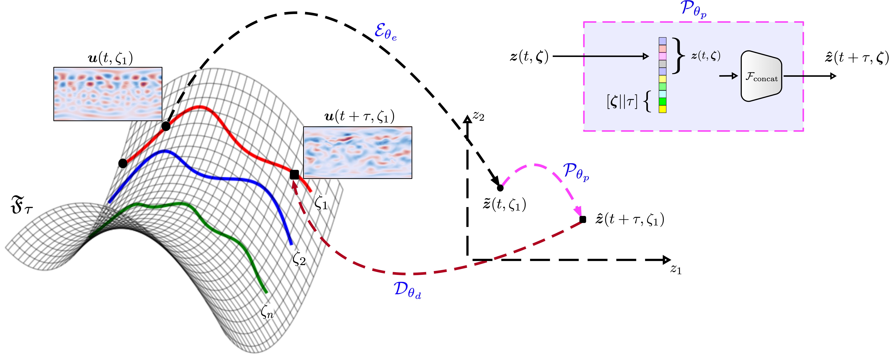
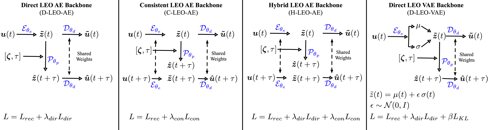

# Latent Evolution Operator (LEO)

**Latent Evolution Operator (LEO)** is a state-to-state forecasting framework for parametric transient partial differential equations (PDEs). Instead of rolling out a recurrent latent model step by step, or learning an operator tied mainly to initial-condition inputs, LEO learns a finite-time evolution operator between arbitrary states along a trajectory.

Many operator-learning settings learn maps of the form

$$
u(0,\zeta) \mapsto u(t,\zeta),
$$

where the input is an initial condition. LEO instead learns state-to-state transitions of the form

$$
F_\tau: u(t,\zeta) \mapsto u(t+\tau,\zeta),
$$

so the model can re-anchor from any intermediate transient state and forecast forward in a single latent-space evaluation.


Given an input state $u(t,\zeta)$, physical parameters $\zeta$, and forecast horizon $\tau$, LEO predicts:

```math
\hat{u}(t+\tau,\zeta)
=
D_{\theta_d}
\left(
P_{\theta_p}
\left(
E_{\theta_e}(u(t,\zeta)), \tau, \zeta
\right)
\right)
```

where $E_{\theta_e}$ is an encoder, $P_{\theta_p}$ is a latent propagator, and $D_{\theta_d}$ is a decoder.


## Overview



LEO is designed for **anchor-agnostic state-to-state forecasting**.

This is useful for transient PDE settings where forecasts often need to be restarted or re-anchored from intermediate states, such as data assimilation, model-predictive control, online forecasting, uncertainty quantification, and multi-query surrogate modeling.

## Key Ideas

- Learn finite-time PDE evolution operators of the form $F_\tau: u(t,\zeta) \mapsto u(t+\tau,\zeta)$.
- Forecast from arbitrary intermediate states, not only from fixed initial conditions.
- Avoid recursive rollout and long-horizon error accumulation.
- Support variable forecast horizons $\tau$ and physical parameters $\zeta$.
- Enable fast, anchor-agnostic surrogate modeling for transient parametric PDEs.

## Why State-to-State Forecastin
Many neural-operator models are trained in an initial-condition setting, where the model learns to map an initial state $u(0,\zeta)$ to a future solution $u(t,\zeta)$. This is useful, but it can create a distribution shift when the model is queried from intermediate states along a trajectory.

LEO instead learns state-to-state transitions directly:

$$
u(t,\zeta) \rightarrow u(t+\tau,\zeta).
$$

This allows the model to forecast forward from arbitrary transient states without restarting from $t=0$ and without performing autoregressive rollout.

## Example: Single-Shot Forecasts


The animation shows LEO predictions over increasing forecast horizons. Each prediction is produced as a **single-shot state-to-state forecast**, not as an autoregressive rollout. In other words, the model is repeatedly queried with the same anchor state and different forecast horizons, rather than feeding each prediction back into the model.

## Model Variants


This repository includes several LEO variants:

- **D-LEO-AE**: Direct LEO with deterministic autoencoder backbone.
- **C-LEO-AE**: Consistent LEO with latent-consistency regularization.
- **H-LEO-AE**: Hybrid LEO combining direct forecasting and latent consistency.
- **D-LEO-VAE**: Direct LEO with variational autoencoder backbone.


## Experiments

The framework is evaluated on:

1. **1D Burgers' equation**
2. **2D advection--diffusion equation**
3. **Shallow-water equations**

The experiments study:

- direct state-to-state forecasting accuracy,
- extrapolation in physical parameters and forecast horizon,
- anchor-time generalization from intermediate states,
- latent consistency and encoder--propagator alignment,
- comparison with latent neural-operator baselines,
- runtime speedup over recurrent latent models.

## Links

- Paper: [arXiv:2505.09063](https://arxiv.org/abs/2505.09063)
- Interactive demo: [Hugging Face Space](https://huggingface.co/spaces/krafiq/LEO)

## Repository Structure

```text
Comp_LEO_Variants/
  Comparison of D-LEO-AE, C-LEO-AE, H-LEO-AE, and D-LEO-VAE.

Comp_Operator_BLines/
  Comparisons against latent neural-operator baselines.

D_LEO_VAE_Burgers/
  Main Burgers' equation experiments with the D-LEO-VAE model.

SWE/
  Shallow-water equation experiments.

Train_Other_LEOs/
  Training scripts for additional LEO variants.

assets/
  Figures and animations used in the README.
```

## Notes

This repository accompanies the paper **Latent Evolution Operator (LEO): State-to-State Forecasting of Parametric PDEs**.

The code is organized by experiment. Training data, large checkpoints, and some generated outputs are not included in the repository to keep the release lightweight.

## Citation

```bibtex
@article{rafiq2025latent,
  title={Latent Evolution Operator (LEO): State-to-State Forecasting of Parametric PDEs},
  author={Rafiq, Khalid and Liao, Wenjing and Nair, Aditya G.},
  journal={arXiv preprint arXiv:2505.09063},
  year={2025}
}
```
